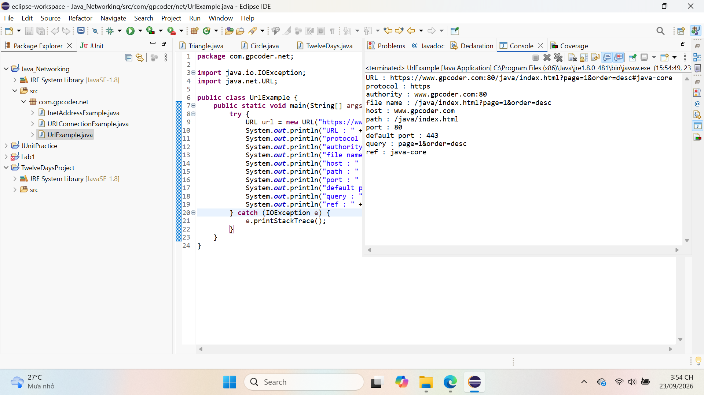
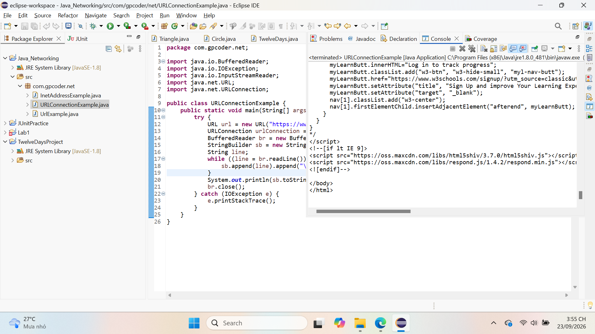
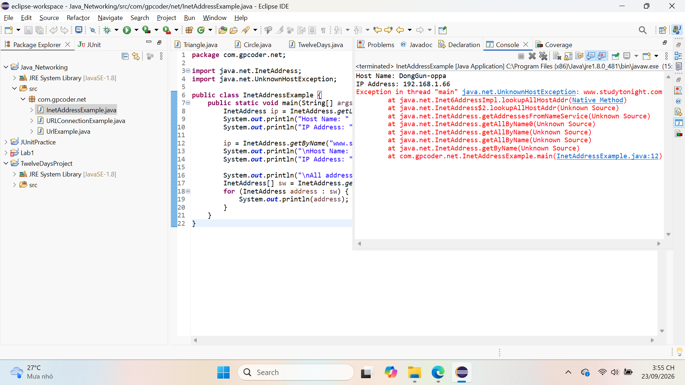

# Bài Tập Thực Hành: Lập Trình Mạng Với Java

- Tên: Lê Ngô Dong Gun
- **Nguồn bài viết:** [GP Coder - Lập trình mạng với Java](https://gpcoder.com/3664-lap-trinh-mang-voi-java/)

## 1. Nội dung mã nguồn (`src/com/gpcoder/net`)
- `UrlExample.java`: Phân tích các thành phần đường dẫn URL.
- `URLConnectionExample.java`: Kết nối và đọc mã nguồn HTML từ website.
- `InetAddressExample.java`: Tra cứu địa chỉ IP cục bộ và địa chỉ IP tên miền.

## 2. Hình ảnh kết quả chạy chương trình

